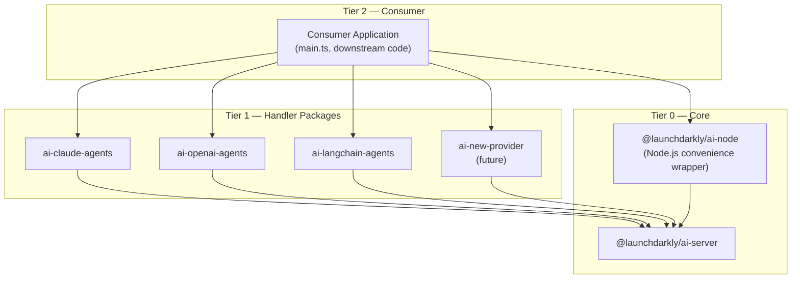

# LaunchDarkly AI SDK — Agent Guide

This document describes the architecture of the LaunchDarkly AI SDK and defines the contracts that all packages must satisfy. It is intended as a reference for AI agents and contributors adding new functionality, particularly new handler packages.

---

---

## Code Quality: Linting, Formatting, and Common Pitfalls

This repo uses **Biome** for formatting + linting and **Sherif** for workspace `package.json` consistency. Always run `make code-fix` before committing to auto-fix issues, and `make code-check` to verify in CI mode (no writes).

### Biome Pitfalls

#### Arrow functions in Vitest mocks break `new` calls

Biome reformats `function()` implementations to arrow functions. Arrow functions **cannot be used as constructors** — any mock called with `new` will throw `TypeError: ... is not a constructor`.

```typescript
// ❌ Biome formats this — but new SomeClass() will throw
SomeClass: vi.fn().mockImplementation(() => ({ method: vi.fn() }))

// ✅ Use class syntax for constructors
SomeClass: class {
  method = vi.fn();
}

// ✅ When the mock also needs spy recording (toHaveBeenCalledWith)
SomeClass: vi.fn(class {
  field: string;
  constructor(args: any) { this.field = args.field; }
})
```

Class **property initializers** are evaluated at instantiation time (not when the class is defined), so variables referenced inside them don't need `vi.hoisted()` — the variables are already initialized by the time any test runs `new SomeClass()`.

However, if you pass a value **eagerly** to `vi.fn().mockReturnValue({...})` inside a `vi.mock` factory, the value is evaluated during hoisting before `const` declarations run. In that case, promote the variable with `vi.hoisted()`:

```typescript
// ❌ Fails: mockFn is in TDZ when the factory runs
const mockFn = vi.fn();
vi.mock('some-module', () => ({
  default: vi.fn().mockReturnValue({ fn: mockFn }),
}));

// ✅ Hoist it
const { mockFn } = vi.hoisted(() => ({ mockFn: vi.fn() }));
vi.mock('some-module', () => ({
  default: class { fn = mockFn; },
}));
```

#### `noConsole` autofix silently removes intentional `console.*` calls

`biome check --write` (and `biome lint --write`) will delete `console.warn`, `console.error`, and similar calls that match the `noConsole` rule. Preserve intentional logging with a suppression comment on the line above:

```typescript
// biome-ignore lint/suspicious/noConsole: intentional warning for user misconfiguration
console.warn('Multiple handlers registered...');

// biome-ignore lint/suspicious/noConsole: intentional error logging
console.error(err);
```

#### `noUnusedVariables` renames catch-clause variables — and `noConsole` compounds it

When Biome removes a `console.error(err)` call, `err` becomes unused and gets renamed to `_err`. If you restore the `console.error`, also remove the `_` prefix. The same applies to module-level constants: if Biome renames `LD_OTEL_PEER_DEPS` to `_LD_OTEL_PEER_DEPS` because the only reference was removed, restoring the reference also requires restoring the original name — otherwise you get a `ReferenceError` at runtime.

```typescript
// ❌ After Biome auto-fixes noConsole + noUnusedVariables
} catch (_err) {
  return fallback;
}

// ✅ Restored consistently
} catch (err) {
  // biome-ignore lint/suspicious/noConsole: intentional error logging
  console.error(err);
  return fallback;
}
```

#### Optional chaining vs. non-null assertion — semantics differ

Biome converts non-null assertions `foo!.bar()` to optional chaining `foo?.bar()`. These are **not equivalent**:

- `foo!.bar()` — throws if `foo` is `null` / `undefined`
- `foo?.bar()` — returns `undefined` silently if `foo` is absent

Review these conversions in test assertions — `handler.stream?.(args)` returns `undefined` when `stream` is absent, while `handler.stream!(args)` would throw.

#### Import order is re-sorted alphabetically

Biome organises imports alphabetically within each group. Vitest's `vi.mock` calls are **hoisted to the top of the file** regardless of source order. If mock setup depends on import order, rely on `vi.hoisted()` rather than declaration order.


## Package Hierarchy

The monorepo is organized into three tiers plus a convenience wrapper. Dependencies only flow **downward** — never sideways between packages in the same tier, and never upward.



### Tiers

- **Tier 0 — Core** (`@launchdarkly/ai-server`): The foundation. Owns all LaunchDarkly integration, telemetry orchestration, shared data types, and the primary entry points (`config()`, `graph()`, `resolveGraph()`). Has no dependency on any other `@launchdarkly/ai-server` package.
- **Tier 0 — Convenience wrapper** (`@launchdarkly/ai-node`): A pure barrel that re-exports everything from `@launchdarkly/ai-server` and carries `@launchdarkly/node-server-sdk` as a hard dependency. No new logic — intended as the default install for Node.js applications so consumers do not need to manage the `node-server-sdk` peer dependency themselves.
- **Tier 1 — Handler packages** (`@launchdarkly/ai-claude-agents`, `@launchdarkly/ai-claude-messages`, `@launchdarkly/ai-openai-agents`, `@launchdarkly/ai-openai-messages`, `@launchdarkly/ai-langchain-agents`, `@launchdarkly/ai-langchain-messages`, …): Each wraps a specific AI provider SDK. Depends on `@launchdarkly/ai-server` for shared types and utilities. Must not depend on other Tier 1 packages.
- **Tier 2 — Consumer applications** (e.g. `main.ts`, downstream projects): Imports from one or more handler packages and either `@launchdarkly/ai-node` (standard Node.js) or `@launchdarkly/ai-server` (edge/custom runtime). Owns tool implementations and orchestration logic. No `@launchdarkly/ai` package should ever depend on Tier 2 code.

### Rules

- All shared data types and utilities belong in `@launchdarkly/ai-server`. Handler packages must not re-export or duplicate them.
- A new handler package needs to import `createHandler`, `AiConfigRep`, `parseTemplate`, and optionally `config` from the client. `ProviderHandler` is used as the return type annotation; `createHandler` is always used to produce the actual value.

---

## Client Package (`@launchdarkly/ai-server`)

### Lifecycle

The client manages a singleton connection to LaunchDarkly and the associated telemetry pipeline.

| Export | Description |
|---|---|
| `initClient(options?)` | Auto-discovers and initializes `@launchdarkly/node-server-sdk` (optional peer dep, loaded via dynamic import). Optional — the first AI API call triggers lazy init when `LD_SDK_KEY` is set. Accepts optional overrides for SDK key, base URIs, service name, environment, and OTLP endpoint. Returns `Promise<LDClientInterface>`. On every successful path, including the already-initialized path, flushes `$ld:ai:sdk:info` for any LaunchDarkly AI packages that have not yet reported. |
| `initClient(client)` | **BYOC overload** — accepts a pre-initialized `LDClientInterface` (e.g. from `@launchdarkly/vercel-server-sdk`). Stores it directly without calling the node SDK. Flushes pending `$ld:ai:sdk:info` events. |
| `getClient()` | Returns the initialized `LDClientInterface`. Throws if initialization has not completed. |
| `shutdown()` | Flushes all pending events and telemetry, then closes the client. Must be called before the process exits. Clears sdk-info reporting so a later client reports again. |
| `waitForTelemetry()` | Waits for the OTel provider to be ready. Useful when spans must not be dropped at startup. |
| `shutdownTelemetry()` | Flushes and stops the OTel exporter independently of the LD client. |
| `registerAiSdkPackage(name, version)` | Records a LaunchDarkly AI package identity. Handler and convenience packages call this at import time. |

### Core Data Types

These types are the shared contract between the client and all handler packages. They are the canonical definitions — handler packages import them, never redefine them.

#### `LDContext`

Owned by `@launchdarkly/ai-server` in `src/types.ts`. Import from this package — **not** directly from any LD SDK. The definition is structurally compatible with all LD SDK versions (`@launchdarkly/node-server-sdk`, `@launchdarkly/vercel-server-sdk`, etc.) so any SDK's context object can be passed to our functions without casting.

```ts
type LDContext = LDUser | LDSingleKindContext | LDMultiKindContext;
```

#### `LDClientInterface`

The minimal interface that any LD SDK client must satisfy to be used with this package. `initClient()` and `getClient()` return this type rather than the concrete `LDClient` from any specific SDK.

```ts
interface LDClientInterface {
  variation(key: string, context: LDContext, defaultValue: unknown): Promise<unknown>;
  track(eventName: string, context: LDContext, data?: unknown, metricValue?: number): void;
  flush(): Promise<void>;
  close(): Promise<void>;
}
```

All current LD server/edge SDKs satisfy this interface structurally. Handler packages never need to import or reference the concrete `LDClient` type.

#### `AiConfigRep`

The AI configuration object fetched from a LaunchDarkly flag variation. Represents everything a handler needs to make a provider call.

| Field | Type | Required | Description |
|---|---|---|---|
| `model` | `{ name, region?, parameters?, custom? }` | yes | Provider model to invoke. |
| `provider` | `{ name }` | yes | Identifies the AI provider (e.g. `"Anthropic"`, `"OpenAI"`). Used for handler routing. |
| `instructions` | string | one of | System prompt, may contain `{{variable}}` template placeholders. LD context attributes are also available as `{{ldContext.key}}`, `{{ldContext.email}}`, etc. |
| `messages` | `Array<{ role, content }>` | one of | Conversation history. Roles: `user`, `assistant`, `system`. Message content may use the same `{{variable}}` and `{{ldContext.xxx}}` placeholders. |
| `tools` | `Record<string, Tool>` | no | Named tool definitions available to the model. |
| `judgeConfiguration` | `{ judges: Array<{ key, samplingRate }> }` | no | Controls automatic evaluation judges. |
| `evaluationMetricKey` | string | no | LaunchDarkly metric key for tracking evaluation scores. |
| `outputFormat` | object | no | Optional JSON Schema the model output must conform to. Handlers enforce structured output via the provider's native API where supported, or via system-prompt injection as a fallback. Ignored in streaming mode. |

At least one of `instructions` or a non-empty `messages` array must be present.

#### `Tool`

A tool definition that can be registered with a provider.

| Field | Type | Description |
|---|---|---|
| `name` | string | Unique tool name. |
| `type` | `"function"` | Always `"function"`. |
| `parameters` | object | JSON Schema describing the tool's input parameters. |
| `description` | string? | Human-readable description passed to the model. |
| `customParameters` | object? | Provider-specific extra configuration. |

#### `VariationMeta`

LaunchDarkly metadata attached to a flag variation.

| Field | Type | Description |
|---|---|---|
| `enabled` | boolean? | Whether this variation is active. |
| `variationKey` | string? | Identifier for the specific variation. |
| `version` | number? | Variation version number. |
| `mode` | `'agent' \| 'completion' \| 'judge'` | Execution mode, used alongside `provider.name` to select a handler. |

#### `ProviderResponse`

The value returned to callers of `config().invoke()`.

| Field | Type | Description |
|---|---|---|
| `response` | string | The final text output from the model. |
| `usage` | `{ input, output, total, inputDetails? }` | Normalized token counts. `input` includes all billed input categories; cache-capable providers expose `{ uncached, cacheRead, cacheCreation }` in `inputDetails`. |
| `trackData` | `TrackData` | Tracking payload from this invocation (run ID, config key, etc.). Carried inside each `JudgeTask` so background judge results are attributed to the originating request. |
| `judgeResults` | `Record<string, { usage, response, score }>?` | Results from inline judge evaluations. Present when `skipJudges` is `false` (default) and judges ran. |
| `judgeTasks` | `JudgeTask[]?` | Pre-packaged judge tasks. Present (as an array) when `skipJudges: true`. Each task is fully serialisable and can be passed directly as `workerData` to a `worker_threads.Worker` running `runJudge(task, handlers)`. `undefined` when `skipJudges` is `false`. |

#### `ProviderGraphResponse`

The value returned by `graph().invoke()`.

| Field | Type | Description |
|---|---|---|
| `response` | string | The final text output (from the last node executed). |
| `usage` | `{ input, output, total }` | Aggregate token counts across all nodes. |
| `judgeResults` | `ProviderResponse['judgeResults']?` | Results from a graph-level judge, if configured. |

#### `ConfigArgs`

Arguments accepted by `config()`.

| Field | Type | Description |
|---|---|---|
| `key` | string | LaunchDarkly flag key for the AI config. |
| `handler` | `ProviderHandler \| ProviderHandler[]`? | One handler or an ordered array of handlers. Routing selects the match by provider + mode. |
| `toolHandlers` | `Record<string, Function \| NativeTool>`? | Map of tool name → implementation function (or `NativeTool` sentinel). |
| `registry` | `RegistryInput`? | One or more registries to source handlers and tools from. Local `handler`/`toolHandlers` take precedence. |
| `skipJudges` | `boolean`? | When `true`, `invoke()` does not run judges inline. Instead it returns `judgeTasks: JudgeTask[]` — pre-packaged tasks ready for background thread execution via `runJudge(task, handlers)`. Default: `false`. |

#### `TrackData`

Payload attached to every LaunchDarkly tracking event.

| Field | Type | Description |
|---|---|---|
| `runId` | string | Unique ID for this invocation. |
| `configKey` | string | The flag key that produced the config. |
| `variationKey` | string | The specific variation key. |
| `version` | number | Variation version number. |
| `modelName` | string | Model name from the config. |
| `providerName` | string | Provider name from the config. |
| `graphKey` | string? | Present when the event was produced inside an agent graph. |
| `toolKey` | string? | Present when the event is for a tool call. |
| `judgeConfigKey` | string? | Present when the event is from a judge execution. |

#### `NativeTool`

A marker class for provider built-in tools. Place an instance as a value in `toolHandlers` to signal that the named tool is a native provider capability rather than a user-supplied function.

```ts
new NativeTool(id: symbol, toolName: string)
```

- `id` — a unique symbol identifying the built-in type.
- `toolName` — the exact tool name the provider SDK uses (e.g. `'WebSearch'`, `'Bash'`).

The handler package wires it to the provider SDK's built-in implementation and emits `$ld:ai:tool_call` tracking when the model invokes it.

`NATIVE_TOOL_KEY` is a `Symbol` used internally to attach the original `NativeTool` instance to tracking stubs. Handler packages use it to recover the provider tool name.

#### `ProviderHandler`

The callable data type that handler packages produce. Use `createHandler(providesFor, fn)` to construct one — it attaches `providesFor` and returns the function as a typed `ProviderHandler`. See [Handler Package Contract](#handler-package-contract) for full details.

---

### Agent Graph Types

The graph system resolves a multi-agent topology from a LaunchDarkly flag and provides primitives to execute or walk it.

#### `GraphTopology`

The structure delivered by a graph flag variation.

| Field | Type | Description |
|---|---|---|
| `root` | string | Config key of the root node. |
| `edges` | `Record<string, Array<{ key, handoff? }>>` | Adjacency list: source config key → outgoing edges. |

#### `GraphNode`

A node in a resolved agent graph: an evaluated agent config plus its outgoing edges.

| Field | Type | Description |
|---|---|---|
| `key` | string | The node's config key. |
| `config` | `AiConfigRep` | Evaluated agent config for this node. |
| `meta` | `VariationMeta` | Variation metadata for this node. |
| `edges` | `GraphEdge[]` | Outgoing edges from this node. |
| `isTerminal()` | `() => boolean` | Returns `true` when the node has no outgoing edges. |

#### `GraphEdge`

A directed edge between two agent configs.

| Field | Type | Description |
|---|---|---|
| `key` | string | Stable edge identifier (`${sourceKey}-${targetKey}`). |
| `sourceKey` | string | Source node config key. |
| `targetKey` | string | Target node config key. |
| `handoff` | `Record<string, any>?` | Optional handoff data from the graph definition. |

#### `GraphDefinition`

A resolved agent graph returned by `resolveGraph()`. Exposes topology accessors and execution primitives.

| Method/Field | Description |
|---|---|
| `key` | The graph flag key. |
| `enabled` | Whether the graph is active. |
| `root` | The root `GraphNode`, or `null` if disabled. |
| `getNode(key)` | Returns a node by config key. |
| `getChildNodes(key)` | Returns all outgoing neighbor nodes. |
| `getParentNodes(key)` | Returns all incoming neighbor nodes. |
| `terminalNodes()` | Returns all leaf nodes (no outgoing edges). |
| `edgesFrom(key)` | Returns outgoing edges from a node. |
| `runNode(node, input?, opts?)` | Executes a single node through the tracked `config().invoke()` path. |
| `route(node, input?, opts?)` | Executes a node, presenting outgoing edges as handoff choices; returns the response plus the chosen `next` node. |
| `traverse(fn, ctx?)` | Walks root → leaves (BFS order), awaiting each visitor. |
| `reverseTraverse(fn, ctx?)` | Walks leaves → root (reverse BFS), awaiting each visitor. |

#### `GraphOptions`

Options for `graph()` and `resolveGraph()`. Context is passed per-call.

| Field | Type | Description |
|---|---|---|
| `handlers` | `ProviderHandler[]?` | Candidate handlers for node execution. Required when using `runNode`; may be omitted for framework-native runners. |
| `toolHandlers` | `Record<string, Function \| NativeTool>`? | Global tool handlers shared across all nodes. |
| `graphJudge` | string? | Config key for a graph-level judge evaluated against the final output. |
| `registry` | `Registry`? | Registry to source handlers and tools from. Local values take precedence. |

---

### `config(args)`

The primary entry point for AI config invocations. Accepts either a single handler or an array of handlers and routes to the correct one based on the flag variation's provider and mode. Context is supplied per call so the same instance can serve different users.

| Argument | Description |
|---|---|
| `key` | LaunchDarkly flag key for the AI config. |
| `handler` | One `ProviderHandler` or an array of `ProviderHandler` values (each with `providesFor` set). Optional when using a `registry`. |
| `toolHandlers` | Optional map of tool name → implementation (or `NativeTool`). |
| `registry` | Optional `Registry` to source handlers and tools from. Local `handler`/`toolHandlers` take precedence. |

Returns:

```
{
  invoke(userInput: string | undefined, context: LDContext, variables?: Record<string, any>, history?: Message[]): Promise<ProviderResponse>
  stream(userInput: string | undefined, context: LDContext, variables?: Record<string, any>, history?: Message[]): AsyncGenerator<StreamEvent>
}
```

**Behavior when `.invoke()` is called:**

1. Fetches and validates the `AiConfigRep` variation from LaunchDarkly using `args.key` and the supplied `context`. Throws if the variation is disabled or invalid.
2. Selects the handler by matching on `[config.provider.name, normalized mode]`. Selection priority: (a) exact provider match, (b) wildcard `['*', mode]` fallback for multi-provider adapters (e.g. LangChain). Throws if no matching handler is found.
3. Invokes the selected handler with the config, user input, tool handlers, variables, and history. The `context` passed to `.invoke()` is automatically merged into `variables` under the key `ldContext`, so templates can reference `{{ldContext.key}}`, `{{ldContext.email}}`, etc. Any caller-supplied `ldContext` variable is silently overwritten. If `history` is provided, it is passed to the handler as the 5th positional argument — messages-mode handlers splice it into the messages array; agent-mode handlers append it to the system prompt.
4. Emits LaunchDarkly telemetry events: duration (`$ld:ai:duration:total`), outcome (`$ld:ai:generation:success` / `$ld:ai:generation:error`), and token counts (`$ld:ai:tokens:*`).
5. If `judgeConfiguration` is present:
   - **Default (`skipJudges: false`):** runs each configured judge inline at its `samplingRate`. Results are returned in `ProviderResponse.judgeResults`.
   - **`skipJudges: true`:** builds serialisable `JudgeTask` objects for each judge (no AI calls). Returns them in `ProviderResponse.judgeTasks`. Pass each task to a worker thread calling `runJudge(task, handlers)` for background evaluation.
6. Returns a `ProviderResponse` (always includes `response`, `usage`, and `trackData`).

### `graph(key, options)`

Creates an agent graph caller bound to a graph flag key. Uses a model-driven router: starts at the root node and lets the model choose which outgoing edge to follow at each step, threading each node's output into the next. Stops when the model produces a terminal answer, a leaf is reached, a node is revisited (cycle guard), or the step cap is hit.

Returns `{ invoke(input: string | undefined, context: LDContext, variables?: Record<string, any>): Promise<ProviderGraphResponse> }`.

Requires `handlers` (either in `options` or via `options.registry`) to be set. For framework packages that need to walk the topology and build their own execution structure, use `resolveGraph` instead.

### `resolveGraph(key, options)`

Resolves an agent graph's topology and node configs without executing it. The returned `GraphDefinition` carries `.enabled`; callers should branch on it before traversing. The `options` object extends `GraphOptions` with a required `context: LDContext`.

This is the entrypoint that framework-native runners (`toClaudeAgents`, `toOpenAIAgents`, `toLangGraph`) use to build their own execution structure.

### `Registry` / `globalRegistry` / `compose`

A `Registry` collects handlers and tool handlers that can be shared across multiple `config()`, `graph()`, and `resolveGraph()` calls.

```ts
const registry = new Registry({
  handlers: [createClaudeAgentsHandler()],
  tools: { myTool: myToolFn },
});
```

`.register(config)` can be called multiple times to add more handlers or tools. Duplicate `providesFor` keys or tool names produce a warning and the last registration wins.

`globalRegistry` is a pre-constructed singleton `Registry` instance.

Pass a registry as `options.registry` to any of the top-level APIs. Local `handler`/`toolHandlers` take precedence over registry values.

To combine two registries, use `compose(a, b)`. It returns a new `Registry` whose contents are the union of both, with `b` taking precedence over `a` on any conflict. Neither input is mutated.

```ts
import { compose, globalRegistry } from '@launchdarkly/ai-server';

const combined = compose(globalRegistry, localRegistry);
```

### Utility Helpers

| Export | Description |
|---|---|
| `createHandler(providesFor, handler)` | Attaches `providesFor` metadata to a handler function and returns it as a `ProviderHandler`. This is the canonical way to build any handler — both package-internal factories and user-supplied custom handlers. See [Factory Function](#factory-function). |
| `parseTemplate(template, variables)` | Replaces `{{variable}}` placeholders in a string. Supports dot-notation for nested values (e.g. `{{user.name}}`). Unrecognized placeholders are left as-is. |
| `parseJSONWithPossibleFences(text)` | Parses a JSON string that may be wrapped in markdown code fences (` ```json ` or ` ``` `). Returns `null` if the text is not valid JSON. |

---

## Handler Package Contract

A handler package bridges a specific AI provider SDK to the `@launchdarkly/ai-server` runtime. This section defines everything a new handler package must implement.

### The Handler Type (`ProviderHandler`)

A handler is a **callable that also carries metadata**. It must be both invokable as a function and have a `providesFor` property attached to it.

**Call signature:**

```
(
  config: AiConfigRep,
  userInput?: string,
  toolHandlers?: Record<string, Function | NativeTool>,
  variables?: Record<string, any>,
  history?: Message[]
) => Promise<{ output?: string; usage?: Record<string, any> }>
```

**Metadata property:**

```
providesFor: [providerName: string, mode: 'agent' | 'messages']
```

The `providesFor` tuple is how `config()` routes to the correct handler at runtime. The mode element must exactly match the normalized `meta.mode`. The provider element must either exactly match `config.provider.name` **or** be the wildcard `'*'`. A wildcard handler is chosen only when no handler with an exact provider name matches — it acts as a fallback for multi-provider adapters like LangChain. **Always attach `providesFor` using `createHandler` rather than direct property assignment.**

### Factory Function

Each handler package must export a **factory function** that:

- Accepts optional configuration for the provider SDK client (e.g. API keys, base URLs).
- Initializes any provider-specific resources.
- Returns the handler callable with `providesFor` attached via `createHandler`.

The naming convention is `create<Provider>Handler()`. For example: `createClaudeAgentsHandler()`, `createOpenAIAgentHandler()`.

**Always use `createHandler` to build and return the handler.** It attaches `providesFor` in place and returns the same function reference as a properly typed `ProviderHandler`. Do not manually assign `handler.providesFor` — `createHandler` is the single canonical path.

```ts
import { createHandler, parseTemplate } from '@launchdarkly/ai-server';
import type { ProviderHandler } from '@launchdarkly/ai-server';

export function createMyProviderHandler(): ProviderHandler {
  return createHandler(['MyProvider', 'messages'], async (config, userInput = '', toolHandlers = {}, variables = {}, history) => {
    const systemPrompt = config.instructions ? parseTemplate(config.instructions, variables) : undefined;
    // ... call your provider SDK ...
    return { output: '...', usage: { input_tokens: 10, output_tokens: 20 } };
  });
}
```

`createHandler` is also the recommended pattern for **user-supplied custom handlers** at the application layer — any handler that needs to participate in `config()` routing must have `providesFor` set, and `createHandler` is the right way to do that.

### Prompt Construction

The handler is responsible for translating `AiConfigRep` fields into the prompt format the provider expects:

- If `config.instructions` is present, treat it as the system prompt. Run it through `parseTemplate(config.instructions, variables)` before sending.
- If `config.messages` is present, separate by role: `system`-role messages form the system prompt; `user` and `assistant` messages form the conversation history. Apply `parseTemplate` to each message's content.
- `userInput` is always appended as the final user turn.

> **`ldContext` is always present in `variables`.** The client automatically injects the caller's LD context as `ldContext` before invoking the handler, so `{{ldContext.key}}`, `{{ldContext.email}}`, and any other context attribute are available in every template without any handler-side changes. Handlers must not overwrite or strip `ldContext` from the variables they pass to `parseTemplate`.

### Tool Handling

If `config.tools` is present, the handler must:

1. Convert each `Tool` definition into the format the provider SDK accepts, using the tool's `name`, `description`, and `parameters` (JSON Schema).
2. When the provider requests a tool call, look up the tool name in `toolHandlers` and invoke the matching function with the arguments the model provided.
3. Submit the tool output back to the provider and continue — repeating until the provider produces a final text response (agentic loop).

If `config.tools` is absent or empty, tool handling should be skipped entirely.

**Native tools:** A `toolHandlers` value may be a `NativeTool` instance rather than a plain function. When encountered, the handler should wire it to the provider SDK's built-in capability (not invoke it as a function), and emit `$ld:ai:tool_call` tracking when the model invokes it. Read the `NATIVE_TOOL_KEY` symbol off the tracking stub to recover the original `NativeTool` instance and its `toolName`.

### Telemetry

Handlers must wrap the provider call in an OTel span, following [Gen AI semantic conventions](https://opentelemetry.io/docs/specs/semconv/gen-ai/):

Agent handlers must separate orchestration from operations: one
LaunchDarkly-correlated `invoke_agent` root, child spans for each provider
turn, and child spans for each tool execution. Conversation content goes on span
attributes, never on span events; model and tool operations must not be
represented only as events.

**One span vocabulary, across every handler.** All six emit `invoke_agent`, one
`chat` per model response, and `execute_tool <name>` per tool call — and
nothing else. A handler must never forward another tool's instrumentation into the
trace: `claude-agents` deliberately leaves the Claude Code CLI's own exporter off,
because its `claude_code.*` span names are outside the semantic conventions, only
become `chat` / `execute_tool` after a LaunchDarkly-specific ingest translation,
and duplicate spans the handler already emits. A trace this SDK produces has to
read the same way on any OTel backend.

Where a handler's SDK hides the request — `claude-agents`, whose Claude Code CLI
assembles it in another process — the `chat` span reports the conversation it
watched arrive rather than the request it cannot see. Every user and assistant turn
reaches the handler on the message stream, so each `chat` span carries the turns
that preceded its own response as `gen_ai.input.messages`. What stays out of reach
is the CLI's own system prompt and the schemas for its built-in tools; those live
only in that process, and no span here claims otherwise. A description built from
messages the handler actually received is honest; inventing the request would not
be.

**Span attributes:**
- `gen_ai.system` — provider identifier (e.g. `"anthropic"`, `"openai"`)
- `gen_ai.operation.name` — operation type (e.g. `"chat"`)
- `gen_ai.request.model` — the model name from `config.model.name`
- `gen_ai.usage.input_tokens`, `gen_ai.usage.output_tokens`, `gen_ai.usage.total_tokens`
- Provider-specific cache-token attributes when available; for Anthropic,
  `gen_ai.usage.input_tokens` includes uncached, cache-read, and cache-creation
  input, with the breakdown in `gen_ai.usage.cache_read.input_tokens` and
  `gen_ai.usage.cache_creation.input_tokens`

**Content attributes** — only when the caller passes `captureContent: true`.
Conversation content is PII, so it is off by default and every write goes
through `client/src/content.ts`, which takes the flag as an argument:
- `gen_ai.system_instructions` — the system prompt, as a JSON part array
- `gen_ai.input.messages` / `gen_ai.output.messages` — the canonical
  `[{ role, parts }]` JSON from the OTel GenAI semconv
- `gen_ai.tool.definitions` — the catalog as offered to the model, not as
  configured
- `gen_ai.tool.call.arguments` / `gen_ai.tool.call.result` — on `execute_tool`
  spans
- `gen_ai.prompt.{i}.role|content` / `gen_ai.completion.{i}.role|content` — the
  older flat shape, written alongside the canonical one because LaunchDarkly's
  trace view parses only this pair today

Span events are not a content carrier. OTEP 4430 deprecated the span-event
recording API, and the `gen_ai.content.prompt` / `gen_ai.content.completion`
events these handlers used to emit were read by nothing on the LaunchDarkly
side. The only event a handler emits is `feature_flag`, on the root, for
trace correlation. When `variables.ldContext` has a usable identity, that
event also carries `feature_flag.context.id` and `feature_flag.contextKeys`,
and the root span gets `context.contextKeys.<kind>`. Child spans must not.

That rule is about handlers. The core client emits one more event, on judge
`invoke_agent` spans only: `gen_ai.evaluation.result`, written by
`withJudgeEvaluation` in `client/src/conversation.ts`. It carries
`gen_ai.evaluation.name` and `gen_ai.evaluation.score.value` — a config key and
a number, no conversation content — and the same two keys are mirrored as span
attributes. It is defined by the GenAI semantic conventions and read by the
conversation view's turn badges, so do not "fix" it by deleting it.

The judge's reasoning is deliberately **not** on the span or the event.
`gen_ai.evaluation.explanation` is model-generated prose about the user's
conversation, which makes it a content attribute under the rule above, and
`captureContent` is a handler-factory option the client core never receives.
The reasoning still reaches the caller in `judgeResults`; only the telemetry
copy is withheld. Adding it back needs its own opt-in, not a quiet write.

**Span status:**
- Set to OK on success.
- Set to ERROR and record the exception on failure. Re-throw the error after recording.

### Return Shape

The handler must return:

```
{ output?: string; usage?: Record<string, any> }
```

- `output` is the final text response from the model.
- `usage` should include token count fields. The client normalizes these common key variants automatically: `input_tokens`/`output_tokens`, `inputTokens`/`outputTokens`, `input`/`output`.

### Streaming (optional)

A handler package may implement real-time token streaming by passing a streaming generator as the **third argument** to `createHandler`. When present, `config().stream()` calls this instead of the blocking handler and forwards `chunk` events to the caller in real time.

**Type:**

```ts
stream?: (
  config: AiConfigRep,
  userInput?: string,
  toolHandlers?: Record<string, Function | NativeTool>,
  variables?: Record<string, any>,
) => AsyncGenerator<HandlerStreamEvent>
```

**`HandlerStreamEvent`** (from `@launchdarkly/ai-server`):

```ts
type HandlerStreamEvent =
  | { type: 'chunk'; text: string }          // text delta — yield one per streamed token
  | { type: 'done'; output?: string; usage: Record<string, any> }  // final event
```

**Requirements for the streaming generator:**

1. Yield `{ type: 'chunk', text }` for each token or text delta received from the provider.
2. Handle tool loops between stream turns: execute tool calls synchronously (or with `await`), then start the next streaming turn. Chunks from each turn are forwarded sequentially.
3. Yield exactly one `{ type: 'done', output, usage }` event as the last item. `output` may be omitted if the accumulated chunks are sufficient; `usage` should include token counts using any of the standard key variants (`input_tokens`/`output_tokens`, `inputTokens`/`outputTokens`, or `input`/`output`).
4. Manage the OTel span manually (`startSpan` / `span.end()`) rather than using `startActiveSpan`, since the generator yields across suspension points.
5. On error: record the exception (`span.recordException`), set status to `ERROR`, call `span.end()`, and re-throw.

**Example pattern:**

```ts
export function createMyProviderHandler(): ProviderHandler {
  return createHandler(
    ['MyProvider', 'messages'],
    async (config, userInput = '', toolHandlers = {}, variables = {}, history) => {
      // ... blocking implementation ...
    },
    async function* streamHandler(config, userInput = '', toolHandlers = {}, variables = {}, history) {
      const span = trace.getTracer('my-package').startSpan('my.stream');
      try {
        // ... stream from provider SDK ...
        for await (const chunk of providerStream) {
          yield { type: 'chunk', text: chunk.text };
        }
        yield { type: 'done', output: fullText, usage: { input_tokens: 10, output_tokens: 20 } };
        span.setStatus({ code: SpanStatusCode.OK });
      } catch (err) {
        span.recordException(err as Error);
        span.setStatus({ code: SpanStatusCode.ERROR, message: String(err) });
        throw err;
      } finally {
        span.end();
      }
    },
  );
}
```

When a handler does **not** implement `stream`, `config().stream()` falls back to the blocking handler and emits its full output as a single `chunk` before the `done` event.

### Convenience Export (optional)

A handler package may optionally export a thin wrapper that pre-wires the handler into `config()`, for callers that only ever use one provider:

```
xxx(configKey: string, userInput: string, context: LDContext, options?: Omit<ConfigArgs, 'handler' | 'key'>) => Promise<ProviderResponse>
```

For example, `claudeAgents(configKey, userInput, context, options)` is equivalent to `config({ ...options, key: configKey, handler: createClaudeAgentsHandler() }).invoke(userInput, context)`.

The naming convention matches the package suffix: `claudeAgents`, `claudeMessages`, `openaiAgents`, `openaiMessages`, `langchainAgents`, `langchainMessages`.

This is a convenience only — it is not required and must not contain any logic beyond wiring the handler.

### Graph Export (optional)

An agent-mode handler package may export a graph convenience wrapper:

```
xxxGraph(key, options) => { invoke(input, context, variables?): Promise<ProviderGraphResponse> }
```

For example, `claudeGraph(key, options)` is equivalent to `graph(key, { ...options, handlers: [createClaudeAgentsHandler()] })`.

Naming convention: `claudeGraph`, `openaiGraph`, `langchainGraph`.

### Native Graph Adapter (optional)

An agent-mode handler package may export a native graph adapter function `to<Provider>(def, options)` that accepts a `GraphDefinition` from `resolveGraph()` and builds a framework-native execution structure (e.g. OpenAI Agents SDK swarm, LangGraph state machine, Claude code-agents graph). This allows the graph topology to be expressed in LaunchDarkly flags while execution is handled by the provider's own framework.

Current adapters:
- `toClaudeAgents(def, options)` — exported from `@launchdarkly/ai-claude-agents`
- `toOpenAIAgents(def, options)` — exported from `@launchdarkly/ai-openai-agents`
- `toLangGraph(def, options)` — exported from `@launchdarkly/ai-langchain-agents`

---

## Claude Provider Built-ins (`@launchdarkly/ai-claude-agents`)

The Claude agents package exports pre-constructed `NativeTool` sentinels for Claude Code built-in capabilities. Place these as values in `toolHandlers` to enable the corresponding native Claude tool without writing a handler function:

| Export | Claude SDK tool name |
|---|---|
| `ClaudeBash` | `Bash` |
| `ClaudeRead` | `Read` |
| `ClaudeEdit` | `Edit` |
| `ClaudeWrite` | `Write` |
| `ClaudeGlob` | `Glob` |
| `ClaudeGrep` | `Grep` |
| `ClaudeWebFetch` | `WebFetch` |
| `ClaudeWebSearch` | `WebSearch` |
| `ClaudeTodoWrite` | `TodoWrite` |
| `ClaudeNotebookEdit` | `NotebookEdit` |

Example:

```ts
import { ClaudeWebSearch, ClaudeBash } from '@launchdarkly/ai-claude-agents';

const response = await graph('my-flag', {
  handlers: [createClaudeAgentsHandler()],
  toolHandlers: {
    'web-search': ClaudeWebSearch,
    'run-bash':   ClaudeBash,
  },
}).invoke(userInput, context);
```
